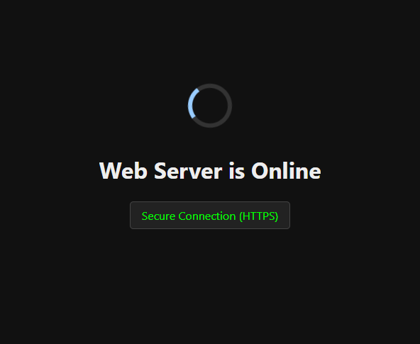

# Website Container

This is a very simple project that deploys a simple website-in-container to listen on port `80` and `443` for helping configure things like reverse proxies.



## Basic Usage

```bash
docker run -d --rm -p 80:80 -p 443:80 umlatt/website-container
```

## Customise Website

To customise the website you can pull the project, edit the index.html and build a container based off of that.

### Pull project

```bash
git clone https://github.com/Umlatt/website-container
cd website-container
```
### Change Webpage

Edit the `index.html` in the directory as required.

### Build and start the website

```bash
docker compose up -d --build
```
